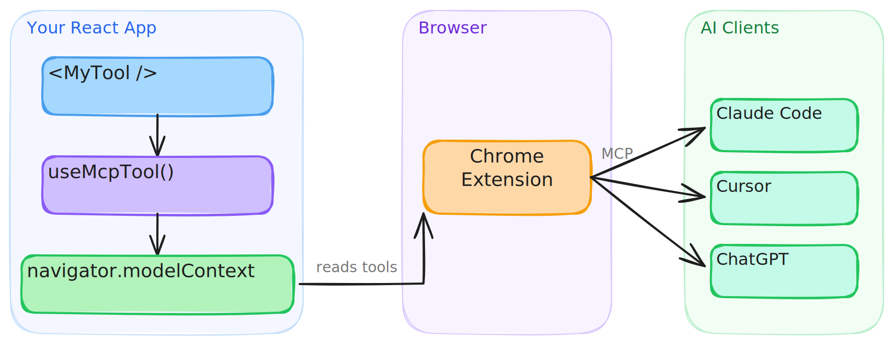

# webmcp-react

React hooks for exposing typed tools on `navigator.modelContext`.

[](https://www.npmjs.com/package/webmcp-react)
[](./LICENSE)
[](https://github.com/MCPCat/webmcp-react/actions/workflows/ci.yml)
[](https://github.com/MCPCat/webmcp-react/pulls)

> Experimental. WebMCP is still evolving, so small API and behavior changes should be expected.

- **Zod-first.** Define inputs with Zod and get full type inference in handlers
- **JSON Schema fallback.** Pass raw JSON Schema when you don't want Zod
- **Built-in polyfill.** Uses a lightweight polyfill when native WebMCP is unavailable
- **SSR-safe.** Works with Next.js, Remix, and other server-rendering frameworks
- **StrictMode safe.** Avoids duplicate registrations and orphaned tools

## Install

```bash
npm install webmcp-react zod
```

## Playground

Try it live: [**WebMCP Wordle Demo**](https://mcpcat.github.io/webmcp-react/playground/)

A fully playable Wordle clone that showcases `webmcp-react` hooks. Tools dynamically register and unregister as the game moves through phases (idle, playing, won/lost), and guesses can be made via keyboard or through a connected MCP agent. Includes a DevPanel for inspecting tool state and an easy-mode toggle that enables a hint tool. Install the Chrome extension to bridge tools to AI clients like Claude and Cursor.

## Quick start

Wrap your app in `<WebMCPProvider>` and register tools with `useMcpTool`:

```tsx
import { WebMCPProvider, useMcpTool } from "webmcp-react";
import { z } from "zod";

function SearchTool() {
  useMcpTool({
    name: "search",
    description: "Search the catalog",
    input: z.object({ query: z.string() }),
    handler: async ({ query }) => ({
      content: [{ type: "text", text: `Results for: ${query}` }],
    }),
  });
  return null;
}

export default function App() {
  return (
    <WebMCPProvider name="my-app" version="1.0">
      <SearchTool />
    </WebMCPProvider>
  );
}
```

That's it. The tool is registered on `navigator.modelContext` and can be called by WebMCP-compatible agents.

### Using an AI agent?

This repo ships with [agent skills](./skills) that can set up webmcp-react and scaffold tools for you. Install them with the [skills CLI](https://skills.sh):

```bash
npx skills add mcpcat/webmcp-react
```

Works with Cursor, Claude Code, GitHub Copilot, Cline, and [18+ other agents](https://vercel.com/docs/agent-resources/skills).

## How it works

[WebMCP](https://github.com/webmachinelearning/webmcp) is an emerging web standard that adds `navigator.modelContext` to the browser, an API that lets any page expose typed, callable tools to AI agents. Native browser support is still experimental and may evolve quickly. Chrome recently [released it in Early Preview](https://developer.chrome.com/blog/webmcp-epp).

This library provides React bindings for that API. `<WebMCPProvider>` installs a polyfill (skipped when native support exists), and each `useMcpTool` call registers a tool that agents can discover and execute.



## Connect to AI clients

Desktop MCP clients like Claude Code and Cursor can't access `navigator.modelContext` directly. The [WebMCP Bridge extension](https://chromewebstore.google.com/detail/webmcp-bridge/chgjbookknohehmaocfijekhaocaanaf) connects your registered tools to any MCP client.

1. Install the extension from the [Chrome Web Store](https://chromewebstore.google.com/detail/webmcp-bridge/chgjbookknohehmaocfijekhaocaanaf)
2. Configure your MCP client — see the [extension setup guide](./extension/README.md) for details

Once Chrome supports this bridging natively, I'll deprecate the extension.

## Recipes

### Execution state

`useMcpTool` returns reactive state you can use to build UI around tool execution:

```tsx
function TranslateTool() {
  const { state, execute } = useMcpTool({
    name: "translate",
    description: "Translate text to Spanish",
    input: z.object({ text: z.string() }),
    handler: async ({ text }) => {
      const result = await translate(text, "es");
      return { content: [{ type: "text", text: result }] };
    },
  });

  return (
    <div>
      <button onClick={() => execute({ text: "Hello" })} disabled={state.isExecuting}>
        {state.isExecuting ? "Translating..." : "Translate"}
      </button>
      {state.lastResult && <p>{state.lastResult.content[0].text}</p>}
      {state.error && <p className="error">{state.error.message}</p>}
    </div>
  );
}
```

### Tool annotations

Hint AI agents about tool behavior with annotations (supports the [full MCP annotation set](https://modelcontextprotocol.io/docs/concepts/tools#annotations)):

```tsx
useMcpTool({
  name: "delete_user",
  description: "Permanently delete a user account",
  input: z.object({ userId: z.string() }),
  annotations: {
    destructiveHint: true,
    idempotentHint: true,
  },
  handler: async ({ userId }) => { /* ... */ },
});
```

### Dynamic tools

Tools register on mount and unregister on unmount. Conditionally render them like any React component:

```tsx
function App({ user }) {
  return (
    <WebMCPProvider name="app" version="1.0">
      <PublicTools />
      {user.isAdmin && <AdminTools />}
    </WebMCPProvider>
  );
}
```

### Callbacks

Run side effects on success or failure:

```tsx
useMcpTool({
  name: "checkout",
  description: "Complete a purchase",
  input: z.object({ cartId: z.string() }),
  handler: async ({ cartId }) => { /* ... */ },
  onSuccess: (result) => analytics.track("checkout_complete"),
  onError: (error) => toast.error(error.message),
});
```

### JSON Schema

Don't want Zod? Pass `inputSchema` directly:

```tsx
useMcpTool({
  name: "calculate",
  description: "Basic arithmetic",
  inputSchema: {
    type: "object",
    properties: {
      a: { type: "number" },
      b: { type: "number" },
      op: { type: "string", enum: ["add", "subtract", "multiply", "divide"] },
    },
    required: ["a", "b", "op"],
  },
  handler: async (args) => {
    const { a, b, op } = args as { a: number; b: number; op: string };
    const result = { add: a + b, subtract: a - b, multiply: a * b, divide: a / b }[op];
    return { content: [{ type: "text", text: String(result) }] };
  },
});
```

### SSR

Works with Next.js, Remix, and any server-rendering framework out of the box. The build includes a `"use client"` banner, so no extra configuration is needed.

## API

See the [full API reference](./docs/api.md).

## License

[MIT](./LICENSE)
