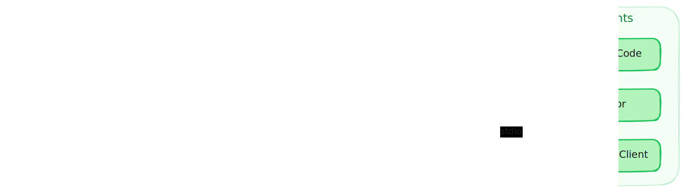

# WebMCP Bridge Server Chrome Extension

A Chrome extension that bridges tools registered on `navigator.modelContext` to desktop AI clients (Claude Code, Cursor, etc.) via MCP.

> Note: This extension is a workaround for now. Once Chrome natively supports some bridge solution, I'll deprecate this extension.

## How it works

Your React app registers tools using `webmcp-react`. The extension picks them up from `navigator.modelContext`, aggregates tools across all active tabs, and exposes them through a local MCP server that clients connect to over stdio.



## Prerequisites

- Node.js 18+
- pnpm
- Chrome

## Setup

### 1. Build the extension

```bash
cd extension
pnpm install
pnpm build
```

### 2. Install in Chrome

1. Open `chrome://extensions/`
2. Enable **Developer mode** (top right)
3. Click **Load unpacked**
4. Select the `extension/dist/` directory

I'll try to release it on the Chrome Webstore so it's easier to install.

### 3. Configure your MCP client

The MCP server runs as a stdio process. Point your client to the built server binary.

**Via npx** (recommended — works with the Chrome Web Store extension):

```bash
# Claude Code
claude mcp add --transport stdio webmcp-server -- npx webmcp-server

# Cursor — add to .cursor/mcp.json
{ "mcpServers": { "webmcp-server": { "command": "npx", "args": ["webmcp-server"] } } }
```

**From source** (if you cloned this repo):
Make sure to run the client from the extension root or use absolute path to `mcp-server.js`

```bash
# Claude Code
claude mcp add --transport stdio webmcp-server -- node ./extension/dist/mcp-server.js

# Cursor — add to .cursor/mcp.json
{ "mcpServers": { "webmcp-server": { "command": "node", "args": ["./extension/dist/mcp-server.js"] } } }
```

## Usage

### Activation modes

Click the extension icon to open the popup. Choose a mode:

| Mode | Behavior |
|------|----------|
| **Off** | No tools exposed |
| **Until reload** | Activate the current tab only. Tools disappear on reload, navigation, or tab close |
| **Always on** | Activate all pages on the current origin. Survives reloads and new tabs |

### Status indicators

- **Green dot** — connected to MCP client, tools available
- **Yellow dot** — extension active but client not connected
- **Grey dot** — inactive

The extension badge shows the number of active tools across all tabs.

### Tool namespacing

Tools from different tabs are namespaced as `tab-{tabId}:{toolName}` to avoid collisions. AI clients see all active tools from all activated tabs.

## Development

```bash
pnpm dev
pnpm typecheck
```

After rebuilding, click the reload button on `chrome://extensions/` to pick up changes.

### Project structure

```
src/
├── background.ts          # Service worker — manages tabs, tools, WebSocket
├── content-main.ts        # Main world script — reads navigator.modelContext
├── content-isolated.ts    # Isolated world script — bridges messages
├── types.ts               # Shared type definitions
├── popup/
│   ├── popup.ts           # Popup UI controller
│   ├── popup.html         # Popup markup
│   └── popup.css          # Popup styles
└── mcp-server/
    ├── index.ts            # MCP server entry — stdio + WebSocket
    └── tool-registry.ts    # Tool lifecycle and MCP protocol conversion
```

### Message flow

1. **content-main.ts** polls `navigator.modelContextTesting` for tool changes
2. Sends tools to **content-isolated.ts** via `window.postMessage`
3. Isolated script forwards to **background.ts** via `chrome.runtime.sendMessage`
4. Background aggregates tools from all tabs and syncs with **mcp-server** over WebSocket (`ws://127.0.0.1:12315`)
5. MCP server exposes tools to AI clients over **stdio**

Tool execution flows in reverse: AI client → MCP server → background → content scripts → page handler → result back through the chain.

## Troubleshooting

**Tools not appearing in your AI client**

- Make sure the extension is activated (green or yellow dot in popup)
- Check that the MCP server is running — your AI client should start it automatically
- Verify your page has tools registered (check the extension popup for a tool list)

**MCP server not connecting (yellow dot)**

- The MCP server listens on `ws://127.0.0.1:12315` by default
- Check if another instance is already running on that port
- Set a custom port with `WEBMCP_BRIDGE_PORT=12316` environment variable

**Extension not detecting tools after page changes**

- In "Until reload" mode, tools are lost on navigation
- In "Always on" mode, the extension may need host permissions for the first time on each page, which requires re-enabling "Always on" after accepting the Chrome permissions prompt

## License

[MIT](../LICENSE)
